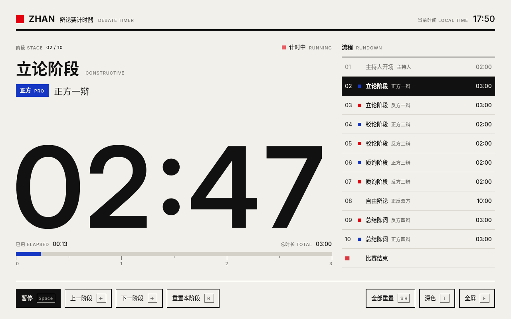
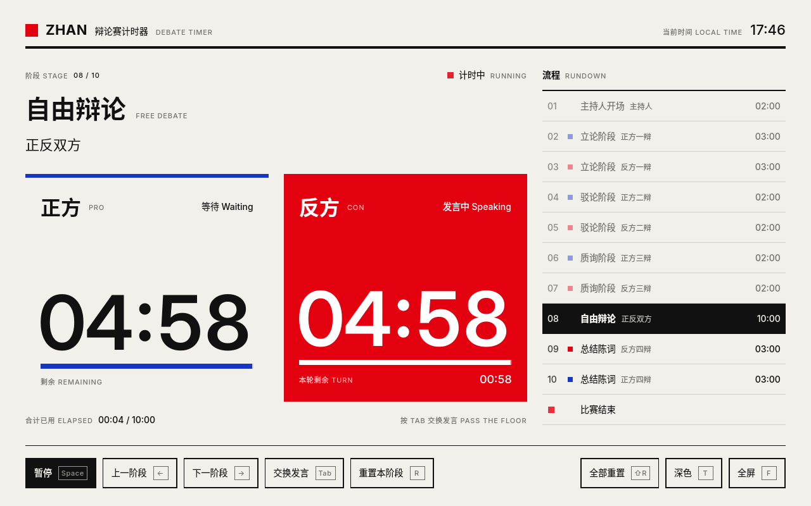
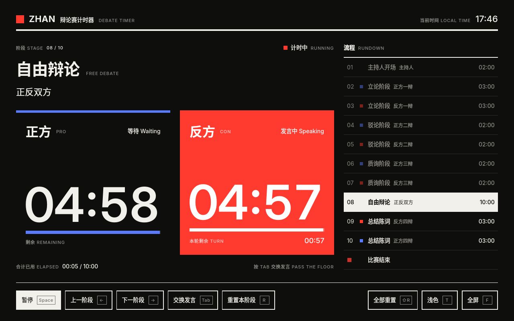

# ZHAN Debate · 辩论赛计时器

ZHAN Debate 是一个辩论赛计时器，帮助主持人和计时员精确掌控每个阶段的发言时间。
它用 C++17 和 Qt 6 编写，**在 Windows 和 Linux 上都是原生程序**；界面采用瑞士国际主义平面风格：严格的 12 栏网格、巨大的数字、黑白红配色与中英双语标注。



| 自由辩论 | 深色模式（适合投影） |
| --- | --- |
|  |  |

## 特性

- **完整赛制流程**：主持开场 → 立论 → 驳论 → 质询 → 自由辩论 → 总结陈词，右侧流程表随时可见，未在计时时点击任一阶段即可跳转。
- **自由辩论双计时**：正反双方各自 5 分钟，当前发言方整栏高亮；单次发言上限 60 秒，到时自动换人。一方用完后，另一方可一次用完剩余时间。
- **醒目的提示**：最后 30 秒数字变红，时间到后数字闪烁并停止计时，由主持人决定何时进入下一阶段。
- **精确计时**：用单调时钟计算实际流逝的时间，不会因为界面卡顿而少计或漂移。
- **全键盘操作**：比赛中不用鼠标，按钮也不会抢走空格键。
- **浅色 / 深色主题**、全屏模式，界面随窗口大小等比缩放。

## 快捷键

| 按键 | 作用 |
| --- | --- |
| `Space` | 开始 / 暂停 / 继续；时间到后进入下一阶段 |
| `→` / `PgDn` | 下一阶段 |
| `←` / `PgUp` | 上一阶段 |
| `Tab` / `S` | 自由辩论中交换发言方（开始前可改由反方先发言） |
| `R` | 重置本阶段 |
| `Shift` + `R` | 全部重置（3 秒内按两次确认，防止误触） |
| `T` | 切换浅色 / 深色 |
| `F` / `F11` | 全屏，`Esc` 退出 |

## 下载

每次推送都会由 GitHub Actions 在 Windows 和 Linux 上自动构建并测试，可在仓库的 **Actions** 页面下载构建产物；推送 `v*` 标签时会自动发布到 **Releases**。

- **Windows**：解压 `zhan-debate-windows-x64`，直接运行 `zhan-debate.exe`，Qt 库与 VC++ 运行库均已随附。
- **Linux**：`zhan-debate-linux-x86_64.tar.gz` 在 Ubuntu 24.04 上构建，需要系统已安装 Qt 6 运行库（见下方依赖）；其他发行版建议从源码编译。

## 从源码编译

需要 CMake 3.21+、支持 C++17 的编译器，以及 Qt 6.4 或更新版本（Qt Quick 模块）。

### Linux

```bash
# Ubuntu / Debian
sudo apt install cmake ninja-build qt6-base-dev qt6-declarative-dev \
  qml6-module-qtquick qml6-module-qtquick-layouts qml6-module-qtquick-window \
  qml6-module-qtqml-workerscript
# Fedora:  sudo dnf install cmake ninja-build qt6-qtbase-devel qt6-qtdeclarative-devel
# Arch:    sudo pacman -S cmake ninja qt6-base qt6-declarative

cmake -S . -B build -G Ninja -DCMAKE_BUILD_TYPE=Release
cmake --build build
ctest --test-dir build          # 运行单元测试
./build/src/app/zhan-debate

sudo cmake --install build      # 可选：安装到系统，包含桌面快捷方式和图标
```

### Windows

1. 安装 Visual Studio 2022（勾选“使用 C++ 的桌面开发”）和 Qt 6（通过 [Qt 在线安装器](https://www.qt.io/download-qt-installer) 选择 MSVC 2022 64-bit 组件）。
2. 在 “x64 Native Tools Command Prompt for VS 2022” 中执行（将路径换成你的 Qt 安装位置）：

```bat
cmake -S . -B build -G Ninja -DCMAKE_BUILD_TYPE=Release -DCMAKE_PREFIX_PATH=C:\Qt\6.8.3\msvc2022_64
cmake --build build
ctest --test-dir build
C:\Qt\6.8.3\msvc2022_64\bin\windeployqt --release --qmldir src\app\qml build\src\app\zhan-debate.exe
build\src\app\zhan-debate.exe
```

也可以直接用 Qt Creator 或 Visual Studio 打开根目录下的 `CMakeLists.txt`。

## 项目结构

```
src/core/     平台无关的计时核心（纯 C++17，不依赖 Qt）
  DebateRules   赛制定义：阶段、时长、自由辩论规则
  DebateTimer   计时状态机：开始、暂停、换人、跳转
src/app/      Qt Quick 桌面程序
  DebateController  把核心暴露给 QML，并用单调时钟驱动计时
  qml/              瑞士风格界面组件
tests/        计时核心的单元测试
resources/    字体（Inter，SIL OFL 1.1）与图标
packaging/    Windows 资源文件与 Linux 桌面文件
```

### 修改赛制

所有阶段都定义在 `src/core/DebateRules.cpp` 的 `Rules::standard()` 中：增删阶段、修改时长、发言方即可，界面会自动适配。自由辩论的单次发言上限（`freeDebateTurnLimitSec`，设为 0 表示不限）和警示秒数（`warningSec`）在 `src/core/DebateRules.h` 中设置。

## 贡献

欢迎提交 issue 或 pull request 提出改进建议或修复 bug。也可以发邮件到 qwqzhanqwq@outlook.com 联系我。

## License

MIT License（详见 [LICENSE.txt](LICENSE.txt)）。内置的 [Inter](https://rsms.me/inter/) 字体使用 SIL Open Font License 1.1（见 [resources/fonts/OFL.txt](resources/fonts/OFL.txt)）。

---

# English

ZHAN Debate is a timer for debate competitions that helps moderators and timekeepers keep every stage on time.
It is written in C++17 with Qt 6 and runs **natively on Windows and Linux**. The interface follows the Swiss International Typographic Style: a strict 12-column grid, oversized numerals, a black / white / red palette and bilingual captions.

## Features

- **Full debate format**: opening → constructive → rebuttal → cross-examination → free debate → closing, with a rundown that is always visible; when the clock is not running, click any stage to jump to it.
- **Two clocks for free debate**: each side has 5 minutes and the side holding the floor is highlighted. A single turn is capped at 60 s and passes automatically; once one side runs out, the other may use all of its remaining time.
- **Clear signals**: the numerals turn red in the last 30 seconds; at zero they blink and the clock stops until the moderator moves on.
- **Accurate timing** based on a monotonic clock, so UI hiccups never lose or add time.
- **Keyboard first** (see the shortcut table above); buttons never steal the Space key.
- **Light / dark themes**, full-screen mode, and a layout that scales with the window.

## Building

Requires CMake 3.21+, a C++17 compiler and Qt 6.4 or newer (Qt Quick).

```bash
cmake -S . -B build -G Ninja -DCMAKE_BUILD_TYPE=Release   # add -DCMAKE_PREFIX_PATH=<Qt dir> if Qt is not found
cmake --build build
ctest --test-dir build
./build/src/app/zhan-debate
```

On Windows, build from the "x64 Native Tools Command Prompt for VS 2022" and run `windeployqt --qmldir src/app/qml` on the executable to bundle the Qt runtime. Prebuilt Windows and Linux packages are produced by GitHub Actions on every push and published to Releases for `v*` tags.

The debate format lives in `Rules::standard()` in `src/core/DebateRules.cpp`.

## License

MIT License (see [LICENSE.txt](LICENSE.txt)). The bundled Inter font is licensed under the SIL Open Font License 1.1.
